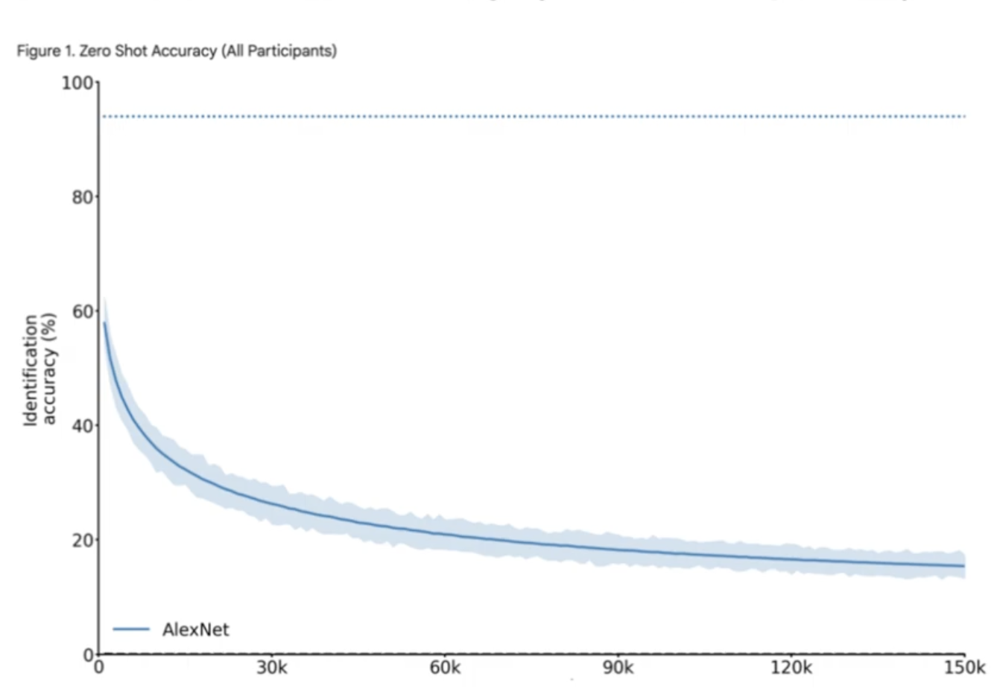

{:style="display:block; margin:0 auto; width: 75%;"}
Zero shot accuracy across participants for EEG decoding image classification using original AlexNet model
{:.image-caption; style="display:block; text-align:center;"}

### Project Description
EEG decoding is an application of machine learning models that have the potential to change lives. Brain-computer interfaces and other medical devices can use neural data decoding to predict and augment human functions such as movement and speech. However, EEG data is notoriously noisy, and machine learning models are utilized to improve the accuracy of this decoding. This project applied Contrastive Language-Image Pretraining (CLIP) models with Convolutional Neural Network (CNN) models to build on previous models for zero-shot image classification. 

### My Contributions
- Replicated the results of Gifford et al. (2022) using the AlexNet model and recorded runtimes to compare computational complexity
- Implemented a custom built CLIP - CNN decoding pipeline that reverses the original direction of information (encoding to decoding) with early stopping that improved the runtime of the training by up to 200 times
- Conducted hyperparameter tuning on dropout rate, batch size, and learning rate and found the model with the highest similarity score between predicted and actual CLIP feature map

### Future Directions
The biggest limitation of this project is that while the computational and time complexity of the model training decreased significantly, so did the model accuracy. However, the model, which accurately guessed the image 7.5% of the time, is still 15 times above chance. This demonstrates that the new model using CLIP and CNN is learning. The next step is to create a model that temporally divides the EEG data to correlate the earlier and later time points with models focused on low level features (e.g. AlexNet) and high level features (e.g. CLIP) respectively. This more accurately simulates the neural mechanisms of object recognition and would help incorporate the accuracy of the original model with the efficiency of the new one.

### Techniques and Tools Used
Python · PyTorch · Scikit-Learn · NumPy

### Code Availability
- [GitHub repository](https://github.com/solacorrado/eeg_encoding/tree/main){:target="_blank"}

### Acknowledgements
This project directly follows the paper ["A large and rich EEG dataset for modeling human visual object recognition"](clinicalkey.com/#!/content/playContent/1-s2.0-S1053811922008758?returnurl=https%3A%2F%2Flinkinghub.elsevier.com%2Fretrieve%2Fpii%2FS1053811922008758%3Fshowall%3Dtrue&referrer=https%3A%2F%2Fgithub.com%2Fsolacorrado%2Feeg_encoding%2Ftree%2Fmain){:target="_blank"} by Alessandro T. Gifford, Kshitij Dwivedi, Gemma Roig, Radoslaw M. Cichy. The code to replicate the original results was forked from their GitHub repository. Data was accessed through [OSF](https://osf.io/3jk45/overview){:target="_blank"} and originates from the [THINGS Initiative](https://things-initiative.org/){:target="_blank"}.