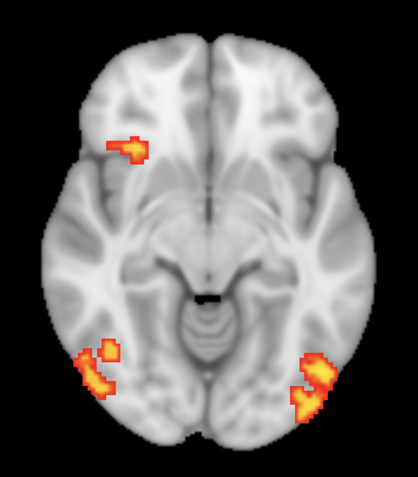

{:style="display:block; margin:0 auto; width: 50%;"}
Activated regions in fMRI data highlighted by FSL
{:.image-caption style="display:block; text-align:center;"}

### Project Description
Episodic counterfactual thinking (eCFT) is the process of imagining how a past personal memory could have gone differently, a cognitive process that sits at the intersection between memory and imagination. Imagining and remembering these simulations are an important way for us to reflect on the past and improve future action. Previous research has found that brain activity from eCFT was more similar to episodic memory when the counterfactual was considered more plausible, and that eCFTs were more memorable when they were perceived as more plausible. This project explores other factors that could contribute to the perceived plausibility of simulated hypotheticals. To examine this, I am conducting functional connectivity analyses of the hippocampus and other brain regions to relate to the perceived plausibility of eCFTs.

The results of this project will lend insight into the mechanisms of the brain when engaging in counterfactual simulations. Understanding the factors that influence plausibility of eCFTs can ultimately inform how to use them to our benefit without becoming detrimental. 

### My Contributions (ongoing)
- Replicating the results of [Khoudary et al. (2022)](https://pubmed.ncbi.nlm.nih.gov/36314151/)
- Conducting functional connectivity analyses using FSL

### Techniques and Tools Used
fMRI · FSL 

### Acknowledgements
This project is conducted in the Imagination and Modal Cognition Lab and is advised by [Dr. Felipe De Brigard](https://scholars.duke.edu/person/felipe.debrigard){:target="_blank"} at Duke University. Direct mentorship is provided by [Ricardo Morales-Torres](https://ricardomoralestorres.com/){:target="_blank"}. 