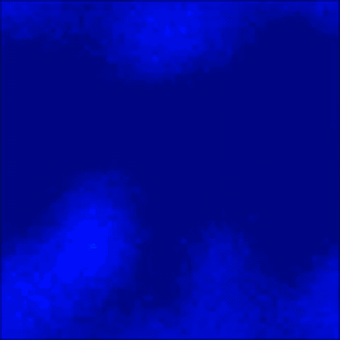

{:style="display:block; margin:0 auto;"}
Simulated local field potential (LFP) for N=450,000 neuron network aggregated in 10×10 neuron pools
{:.image-caption style="display:block; text-align:center;"}

### Project Description
Traveling waves are a biologically observed phenomenon of neural activity propagating across the cortex. Found at many spatiotemporal scales and frequencies, these traveling waves have also been observed in both stimulus-driven and spontaneous states of the brain. The goal of this project was to analyze the detection and quantification of wave activity at different resolution levels and using different analysis techniques. To do this, I simulated manipulating recording resolution and spatial coverage of local field potential (LFP) approximations to measure detected wave activity. Using multiple wave activity quantification methods, the results showed that measured wave activity peaked at a high, but not highest, resolution, and decreased otherwise as a function of resolution and scale. 

This has implications in two domains: recording hardware limitations and underlying wave activity at multiple resolutions. First, the results of the model highlight the importance of using technologies with sufficient spatial resolution and recording coverage. Second, the unexpected decrease of detected wave activity at the highest resolution could suggest wave activity as an emergent property, as opposed to existing at an underlying level.

### My Contributions
- Used Brian2 to custom-build 104–105-neuron two-dimensional lattices incorporating spatiotemporal features of cortex connectivity and validated the results of previous work against [Davis et al. (2021)](https://www.nature.com/articles/s41467-021-26175-1){:target="_blank"} across a range of biologically plausible synaptic interaction strength values
- Transitioned to NETSIM, a custom built Spiking Neural Network simulator by the [Muller Lab](https://mullerlab.io/){:target="_blank"}, for large scale 105–106-neuron network simulations to run experiments through multiprocessing pipelines across Linux cluster (20+ nodes)
- Implemented signal processing and wave analysis pipelines using fourth-order Butterworth bandpass filters, Hilbert transforms, generalized phase, and phase-gradient directionality to compare wave behavior using different wave measurement techniques across resolutions
- Wrote and modified existing scripts to manipulate pool size, grid size, and spacing of LFP approximations and visualized results in line plots and heatmaps

### Future Directions
This project was conducted during the Salk Summer Undergraduate Research Fellowship, but I am continuing to work on it remotely. To further analyze emergent and underlying properties of this detected spontaneous traveling wave activity, I am working on comparing the LFP measurements with the spiking activity to understand the relationship between the input and output activity of the network. I am also working on implementing a Gaussian-weighted, overlapping pooling operator to simulate LFP approximations more realistically.

This project contributes to a broader project analyzing spontaneous traveling waves in lattice models conducted in the Computational Neurobiology Laboratory at the Salk Institute. The next phase of the project is implementing spike-timing-dependent plasticity (STDP) into the network model to more accurately simulate the dynamic plasticity of cortical connectivity.

### Techniques and Tools Used
Python · Linux · Brian2 · NETSIM · NumPy · Matplotlib · Seaborn · SciPy · Multiprocessing · LaTeX

### External Links
The repositories are currently private while the research is ongoing. Please contact me directly for code samples or additional details.

### Acknowledgements
This project was conducted at the Computational Neurobiology Laboratory led by [Dr. Terrence Sejnowski](https://www.salk.edu/scientist/terrence-sejnowski/){:target="_blank"} at the Salk Institute for Biological Studies. Direct mentorship was provided by [Dr. Arjun Karuvally](https://arjunkaruvally.github.io/){:target="_blank"}.